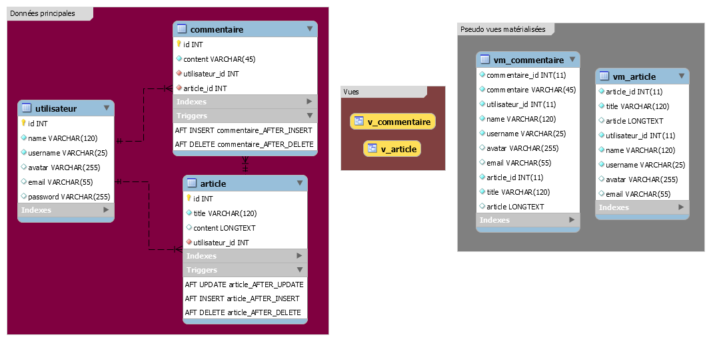

## Data Analysis ##
D'après une étude de fonctionalités, bien que notre base de données ne contient pas du big data, nous allons tout de même optimiser notre base de données pour les requêtes de lecture, en créant des pseudo vues matérialisées.

Nous voulons de façon précise,

1. La liste de tous les articles écrits, avec les données utilisateurs
2. La liste de tous les commentaires écrits, les données de l'article reférent et utilisateurs.

Ces exigences nous imposent un modèle avec des vues, triggers et vues matérialisées que voici:

### Mysql workbench data generating ###
    -- MySQL Script generated by MySQL Workbench
    -- 12/10/14 07:06:47
    -- Model: New ModelVersion: 1.0
    -- MySQL Workbench Forward Engineering
    
    SET @OLD_UNIQUE_CHECKS=@@UNIQUE_CHECKS, UNIQUE_CHECKS=0;
    SET @OLD_FOREIGN_KEY_CHECKS=@@FOREIGN_KEY_CHECKS, FOREIGN_KEY_CHECKS=0;
    SET @OLD_SQL_MODE=@@SQL_MODE, SQL_MODE='TRADITIONAL,ALLOW_INVALID_DATES';
    
    -- -----------------------------------------------------
    -- Schema ci_restapp
    -- -----------------------------------------------------
    
    -- -----------------------------------------------------
    -- Schema ci_restapp
    -- -----------------------------------------------------
    CREATE SCHEMA IF NOT EXISTS `ci_restapp` DEFAULT CHARACTER SET latin1 ;
    USE `ci_restapp` ;
    
    -- -----------------------------------------------------
    -- Table `ci_restapp`.`utilisateur`
    -- -----------------------------------------------------
    DROP TABLE IF EXISTS `ci_restapp`.`utilisateur` ;
    
    CREATE TABLE IF NOT EXISTS `ci_restapp`.`utilisateur` (
      `id` INT NOT NULL AUTO_INCREMENT,
      `name` VARCHAR(120) NOT NULL,
      `username` VARCHAR(25) NOT NULL,
      `avatar` VARCHAR(255) NULL,
      `email` VARCHAR(55) NULL,
      `password` VARCHAR(255) NULL,
      PRIMARY KEY (`id`))
    ENGINE = InnoDB;
    
    CREATE UNIQUE INDEX `username_UNIQUE` ON `ci_restapp`.`utilisateur` (`username` ASC);
    
    CREATE UNIQUE INDEX `email_UNIQUE` ON `ci_restapp`.`utilisateur` (`email` ASC);
    
    
    -- -----------------------------------------------------
    -- Table `ci_restapp`.`article`
    -- -----------------------------------------------------
    DROP TABLE IF EXISTS `ci_restapp`.`article` ;
    
    CREATE TABLE IF NOT EXISTS `ci_restapp`.`article` (
      `id` INT NOT NULL AUTO_INCREMENT,
      `title` VARCHAR(120) NOT NULL,
      `content` LONGTEXT NULL,
      `utilisateur_id` INT NOT NULL,
      PRIMARY KEY (`id`),
      CONSTRAINT `fk_article_utilisateur1`
    FOREIGN KEY (`utilisateur_id`)
    REFERENCES `ci_restapp`.`utilisateur` (`id`)
    ON DELETE CASCADE
    ON UPDATE CASCADE)
    ENGINE = InnoDB;
    
    CREATE INDEX `fk_article_utilisateur1_idx` ON `ci_restapp`.`article` (`utilisateur_id` ASC);
    
    
    -- -----------------------------------------------------
    -- Table `ci_restapp`.`commentaire`
    -- -----------------------------------------------------
    DROP TABLE IF EXISTS `ci_restapp`.`commentaire` ;
    
    CREATE TABLE IF NOT EXISTS `ci_restapp`.`commentaire` (
      `id` INT NOT NULL AUTO_INCREMENT,
      `content` VARCHAR(180) NOT NULL,
      `utilisateur_id` INT NOT NULL,
      `article_id` INT NOT NULL,
      PRIMARY KEY (`id`),
      CONSTRAINT `fk_commentaire_utilisateur`
    FOREIGN KEY (`utilisateur_id`)
    REFERENCES `ci_restapp`.`utilisateur` (`id`)
    ON DELETE CASCADE
    ON UPDATE CASCADE,
      CONSTRAINT `fk_commentaire_article1`
    FOREIGN KEY (`article_id`)
    REFERENCES `ci_restapp`.`article` (`id`)
    ON DELETE CASCADE
    ON UPDATE CASCADE)
    ENGINE = InnoDB;
    
    CREATE INDEX `fk_commentaire_utilisateur_idx` ON `ci_restapp`.`commentaire` (`utilisateur_id` ASC);
    
    CREATE INDEX `fk_commentaire_article1_idx` ON `ci_restapp`.`commentaire` (`article_id` ASC);
    
    
    -- -----------------------------------------------------
    -- Table `ci_restapp`.`vm_commentaire`
    -- -----------------------------------------------------
    DROP TABLE IF EXISTS `ci_restapp`.`vm_commentaire` ;
    
    CREATE TABLE IF NOT EXISTS `ci_restapp`.`vm_commentaire` (
      `commentaire_id` INT(11) NOT NULL DEFAULT '0',
      `commentaire` VARCHAR(180) NOT NULL,
      `utilisateur_id` INT(11) NOT NULL DEFAULT '0',
      `name` VARCHAR(120) NOT NULL,
      `username` VARCHAR(25) NOT NULL,
      `avatar` VARCHAR(255) NULL DEFAULT NULL,
      `email` VARCHAR(55) NULL DEFAULT NULL,
      `article_id` INT(11) NOT NULL DEFAULT '0',
      `title` VARCHAR(120) NOT NULL,
      `article` LONGTEXT NULL DEFAULT NULL)
    ENGINE = InnoDB
    DEFAULT CHARACTER SET = latin1;
    
    CREATE INDEX `index2` ON `ci_restapp`.`vm_commentaire` (`utilisateur_id` ASC);
    
    CREATE INDEX `index3` ON `ci_restapp`.`vm_commentaire` (`article_id` ASC);
    
    CREATE INDEX `index4` ON `ci_restapp`.`vm_commentaire` (`name` ASC);
    
    CREATE INDEX `index5` ON `ci_restapp`.`vm_commentaire` (`username` ASC);
    
    CREATE INDEX `index6` ON `ci_restapp`.`vm_commentaire` (`email` ASC);
    
    CREATE INDEX `index7` ON `ci_restapp`.`vm_commentaire` (`title` ASC);
    
    CREATE INDEX `index1` ON `ci_restapp`.`vm_commentaire` (`commentaire_id` ASC);
    
    
    -- -----------------------------------------------------
    -- Table `ci_restapp`.`vm_article`
    -- -----------------------------------------------------
    DROP TABLE IF EXISTS `ci_restapp`.`vm_article` ;
    
    CREATE TABLE IF NOT EXISTS `ci_restapp`.`vm_article` (
      `article_id` INT(11) NOT NULL DEFAULT '0',
      `title` VARCHAR(120) NOT NULL,
      `article` LONGTEXT NULL DEFAULT NULL,
      `utilisateur_id` INT(11) NOT NULL DEFAULT '0',
      `name` VARCHAR(120) NOT NULL,
      `username` VARCHAR(25) NOT NULL,
      `avatar` VARCHAR(255) NULL DEFAULT NULL,
      `email` VARCHAR(55) NULL DEFAULT NULL)
    ENGINE = InnoDB
    DEFAULT CHARACTER SET = latin1;
    
    CREATE INDEX `index2` ON `ci_restapp`.`vm_article` (`title` ASC);
    
    CREATE INDEX `index3` ON `ci_restapp`.`vm_article` (`utilisateur_id` ASC);
    
    CREATE INDEX `index4` ON `ci_restapp`.`vm_article` (`name` ASC);
    
    CREATE INDEX `index5` ON `ci_restapp`.`vm_article` (`username` ASC);
    
    CREATE INDEX `index6` ON `ci_restapp`.`vm_article` (`email` ASC);
    
    CREATE INDEX `index1` ON `ci_restapp`.`vm_article` (`article_id` ASC);
    
    USE `ci_restapp` ;
    
    -- -----------------------------------------------------
    -- View `ci_restapp`.`v_commentaire`
    -- -----------------------------------------------------
    DROP VIEW IF EXISTS `ci_restapp`.`v_commentaire` ;
    USE `ci_restapp`;
    CREATE  OR REPLACE VIEW `v_commentaire` AS
    select commentaire.id as commentaire_id, commentaire.content as commentaire, utilisateur.id as utilisateur_id, utilisateur.name, utilisateur.username, utilisateur.avatar, utilisateur.email, article.id as article_id, article.title, article.content as article from commentaire inner join utilisateur on commentaire.utilisateur_id=utilisateur.id inner join article on commentaire.article_id=article.utilisateur_id;
    
    -- -----------------------------------------------------
    -- View `ci_restapp`.`v_article`
    -- -----------------------------------------------------
    DROP VIEW IF EXISTS `ci_restapp`.`v_article` ;
    USE `ci_restapp`;
    CREATE  OR REPLACE VIEW `v_article` AS
    select article.id as article_id, article.title, article.content as article, utilisateur.id as utilisateur_id, utilisateur.name, utilisateur.username, utilisateur.avatar, utilisateur.email from article inner join utilisateur on article.utilisateur_id=utilisateur.id;
    USE `ci_restapp`;
    
    DELIMITER $$
    
    USE `ci_restapp`$$
    DROP TRIGGER IF EXISTS `ci_restapp`.`article_AFTER_INSERT` $$
    USE `ci_restapp`$$
    CREATE DEFINER = CURRENT_USER TRIGGER `ci_restapp`.`article_AFTER_INSERT` AFTER INSERT ON `article` FOR EACH ROW
       begin
       insert into vm_article select * from v_article where article_id=new.id;
       end$$
    
    
    USE `ci_restapp`$$
    DROP TRIGGER IF EXISTS `ci_restapp`.`article_AFTER_UPDATE` $$
    USE `ci_restapp`$$
    CREATE DEFINER = CURRENT_USER TRIGGER `ci_restapp`.`article_AFTER_UPDATE` AFTER UPDATE ON `article` FOR EACH ROW
    begin
    update vm_article set title=new.title and article=new.content where article_id=old.id;
    end$$
    
    
    USE `ci_restapp`$$
    DROP TRIGGER IF EXISTS `ci_restapp`.`article_AFTER_DELETE` $$
    USE `ci_restapp`$$
    CREATE DEFINER = CURRENT_USER TRIGGER `ci_restapp`.`article_AFTER_DELETE` AFTER DELETE ON `article` FOR EACH ROW
    BEGIN
    	delete from vm_article where article_id=old.id;
    	END$$
    
    
    USE `ci_restapp`$$
    DROP TRIGGER IF EXISTS `ci_restapp`.`commentaire_AFTER_INSERT` $$
    USE `ci_restapp`$$
    CREATE DEFINER = CURRENT_USER TRIGGER `ci_restapp`.`commentaire_AFTER_INSERT` AFTER INSERT ON `commentaire` FOR EACH ROW
    begin
    insert into vm_commentaire select * from v_commentaire where commentaire_id=new.id;
    end$$
    
    
    USE `ci_restapp`$$
    DROP TRIGGER IF EXISTS `ci_restapp`.`commentaire_AFTER_DELETE` $$
    USE `ci_restapp`$$
    CREATE DEFINER = CURRENT_USER TRIGGER `ci_restapp`.`commentaire_AFTER_DELETE` AFTER DELETE ON `commentaire` FOR EACH ROW
     begin
     delete from vm_commentaire where commentaire_id=old.id;
     end$$
    
    
    DELIMITER ;
    
    SET SQL_MODE=@OLD_SQL_MODE;
    SET FOREIGN_KEY_CHECKS=@OLD_FOREIGN_KEY_CHECKS;
    SET UNIQUE_CHECKS=@OLD_UNIQUE_CHECKS;
    